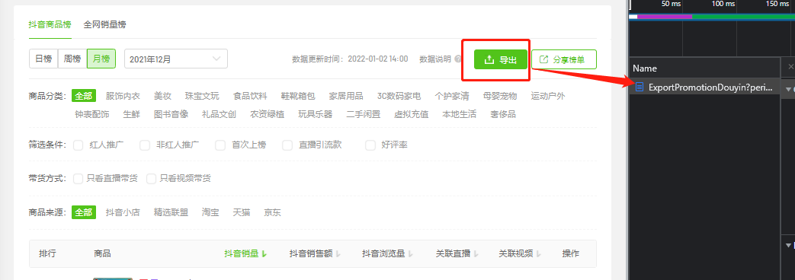
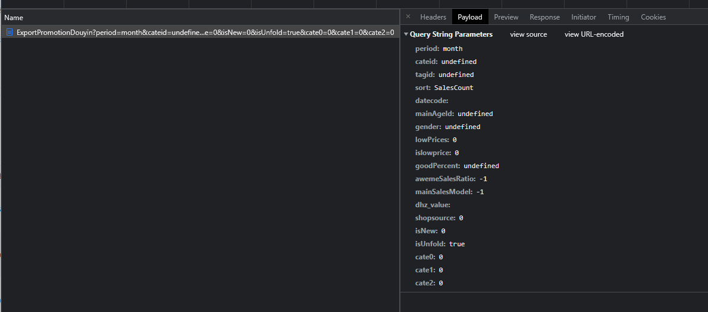
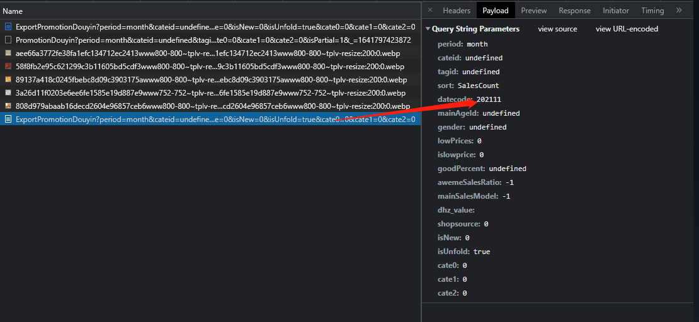
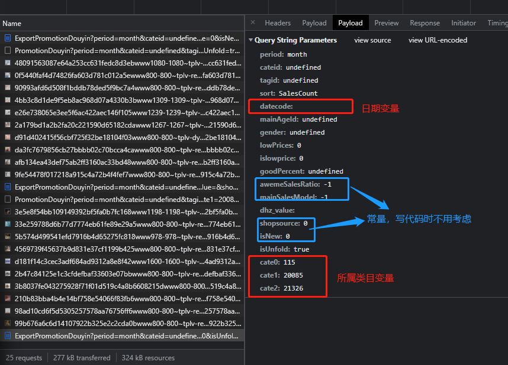
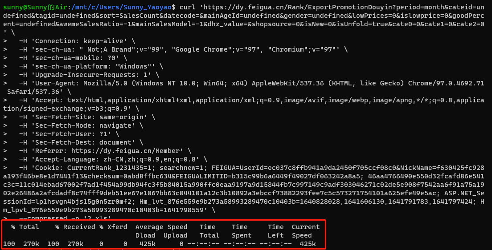
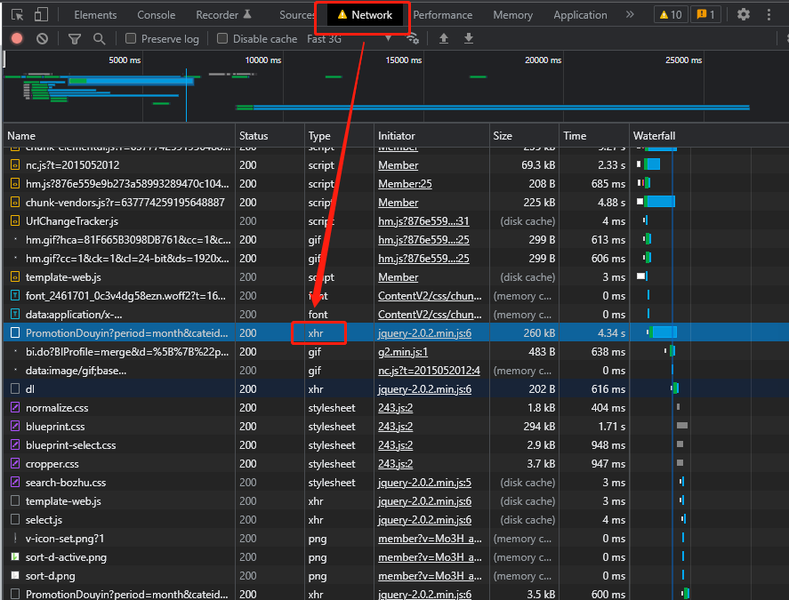
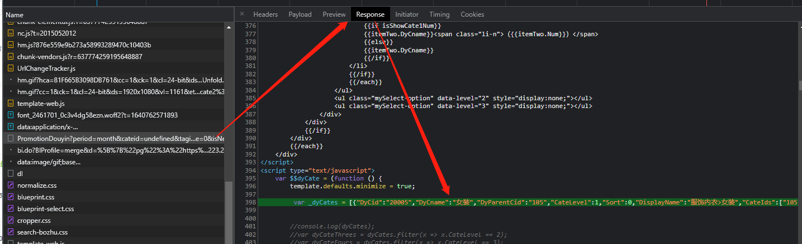
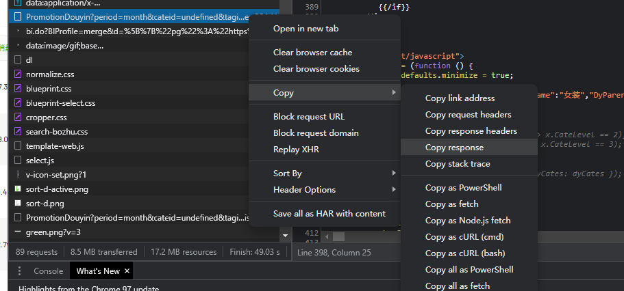

<!--
 * @Description: 
 * @version: 
 * @Author: Sunny
 * @Date: 2022-01-14 11:01:22
 * @LastEditors: Sunny
 * @LastEditTime: 2022-01-14 14:27:26
-->
<!-- TOC -->autoauto- [飞瓜数据中关于市场大盘的数据爬取](#飞瓜数据中关于市场大盘的数据爬取)auto  - [获知参数变化的值](#获知参数变化的值)auto  - [copy curl 验证是否能够下载文件](#copy-curl-验证是否能够下载文件)auto  - [在Network中寻找 .xhr文件（这是个人经验，需要长时间积累）](#在network中寻找-xhr文件这是个人经验需要长时间积累)auto  - [将找到的.xlr文件点开搜索需要的代码段](#将找到的xlr文件点开搜索需要的代码段)auto  - [python读入json处理，将其解析转成Dataframe](#python读入json处理将其解析转成dataframe)auto  - [本次实操需要注意的点](#本次实操需要注意的点)auto- [爬取下来的数据处理问题](#爬取下来的数据处理问题)autoauto<!-- /TOC -->

# 飞瓜数据中关于市场大盘的数据爬取(**<font color = 'red'>dyCate.py</font>**)

##  获知参数变化的值
- 1.
- 2.查看变量参数的变化，在界面操作点击不同的变量参数位置，洞悉不同参数变量的改变 
- 3.
  
  
## copy curl 验证是否能够下载文件
- 
<font color = "	#EEB4B4" size = '4'> copy as curl(bash)命令测试</font>

## 在Network中寻找 .xhr文件（这是个人经验，需要长时间积累）
- 
## 将找到的.xlr文件点开搜索需要的代码段
- 
- 快速获取我们想要的json文件可以直接copy response产品的类目到notepad++然后删除我们不需要的部分
 
##  python读入json处理，将其解析转成Dataframe
- 这里直接使用pd.DataFrame()来操作


## 本次实操需要注意的点
- 延迟处理
>延迟处理最好保证时间的随机性
  时间保持在30s以上
- 判断文件是否存在，如果存在则不下载，直接跳过
> 对于下载过的文件不进行重复下载处理
> 这里使用os.path.isfile()方法
- 超时处理
> 对于爬取的过程中会出现timeout的情况，要对这部分数据进行提前预判
> 主要使用try ……exption……

# 爬取下来的数据处理问题(<font color = 'red'>to_csv.py</font>)
- 处理流程：
> 1. 将数据批量读取进来
> 2. 每次读取进来的表格式相同，只需要将每次将表append上去
> 3. 针对每次需要`订单明细`按照`<` 符号拆分为不同的类目
> <br>``` df['商品ID'] = df['商品链接'].map(lambda x:re.split('=|&',x)[1]) ```
> 4. 将`商品ID`从`商品标题`中提取出来
> <br>
``` file[['一级类目','二级类目','三级类目','四级类目']] = file['细分类目'].str.split('>',expand=True)```
